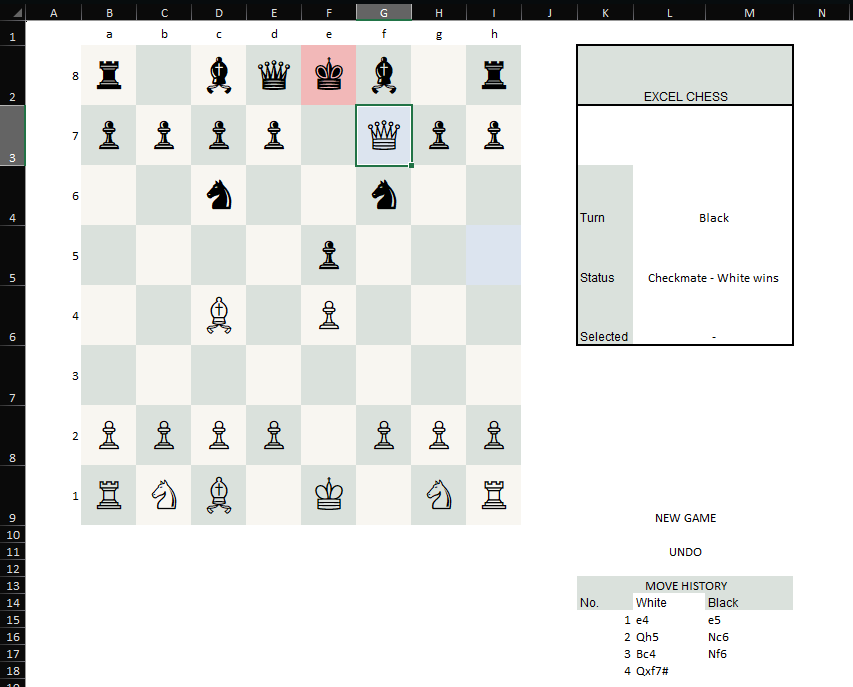
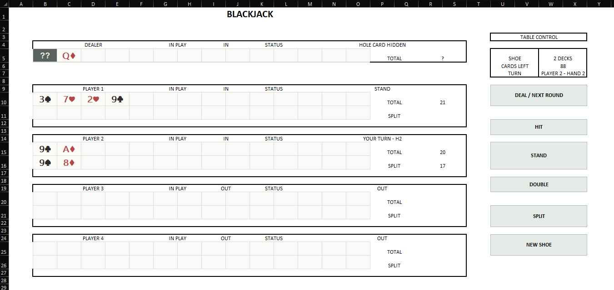

# Excel Arcade

A collection of fully playable games built entirely inside Microsoft Excel using VBA.

The project currently includes:

- Chess
- Blackjack

Both games use Excel cells as the user interface while VBA handles game logic, state management, rule validation, and interaction.

No external game engine, graphics library, or additional dependency is required.

## Screenshots

### Chess



### Blackjack



---

## Chess

A fully playable chess implementation running entirely inside an Excel worksheet.

Selecting a piece dynamically highlights its legal moves, while the VBA engine validates the game state before allowing a move.

### Features

- Legal movement for all chess pieces
- Interactive legal move highlighting
- Capture highlighting
- Turn-based gameplay
- King safety validation
- Check detection
- Checkmate detection
- Stalemate detection
- Pinned-piece handling
- Discovered checks
- Double-check handling through legal move validation
- Kingside castling
- Queenside castling
- Castling-right tracking after king or rook movement
- En passant
- Pawn promotion
- Underpromotion to rook, bishop, or knight
- Threefold repetition draw claims
- Fivefold repetition automatic draw
- 50-move rule draw claims
- 75-move rule automatic draw
- Standard Algebraic Notation (SAN) move history
- Last-move highlighting
- Undo
- New Game

The engine prevents moves that would leave the player's own king in check, so legal moves are evaluated based on both piece movement and the resulting board state.

Standard insufficient-material positions are also detected.

---

## Blackjack

A multiplayer Blackjack implementation using a persistent two-deck shoe.

Instead of independently generating a random card every time a card is requested, the game creates two complete 52-card decks in memory, shuffles the resulting 104-card shoe, and draws cards sequentially from it.

This means card probabilities naturally change throughout the shoe.

### Features

- Real 104-card shoe
- Two complete 52-card decks
- Fisher-Yates shuffle
- Persistent shoe across multiple rounds
- Changing probabilities as cards leave the shoe
- New Shoe control
- Up to four players
- Individual IN / OUT player selection
- Optional dealer mode
- Hidden dealer hole card
- Dealer card is determined when dealt, not generated later
- Hit
- Stand
- Double
- Split
- Split aces
- Soft ace calculation
- Natural blackjack detection
- Split 21 treated separately from natural blackjack
- Dealer stands on soft 17
- Automatic dealer play
- Win, loss, push, blackjack, and bust evaluation
- Practice mode when the dealer is OUT

Because the game uses a finite shoe, impossible card sequences cannot occur.

For example, two decks contain exactly eight aces. If all eight aces have already been dealt, another ace cannot appear until a new shoe is created.

The shoe also persists between rounds, so starting a new round does not reset the remaining cards.

---

## Project Structure

```text
excel-arcade-vba/
|
|-- ExcelArcade.xlsm
|-- README.md
|
|-- src/
|   |-- ChessEngine.bas
|   |-- BlackjackEngine.bas
|   |-- ChessBoard.cls
|   |-- Blackjack.cls
|   `-- ThisWorkbook.cls
|
`-- screenshots/
    |-- Chess.png
    `-- Blackjack.png
```

---

## Running the Project

1. Download `ExcelArcade.xlsm`.
2. Open the workbook using Microsoft Excel for Windows.
3. Enable macros when prompted.
4. Open either the `Chess Board` or `Blackjack` worksheet.
5. Play directly through the worksheet interface.

The desktop version of Microsoft Excel with VBA support is required.

---

## Source Code

The complete playable application is contained in:

`ExcelArcade.xlsm`

The VBA source is also exported separately so the implementation can be reviewed directly on GitHub.

### Chess

- `src/ChessEngine.bas`
- `src/ChessBoard.cls`

### Blackjack

- `src/BlackjackEngine.bas`
- `src/Blackjack.cls`

### Workbook Events

- `src/ThisWorkbook.cls`

---

## Technical Highlights

This project demonstrates:

- Event-driven VBA programming
- Game-state management
- Rule-based validation
- Interactive worksheet interfaces
- State-dependent user controls
- Algorithmic move generation
- Move simulation for chess king safety
- Finite-deck simulation
- Fisher-Yates shuffling
- Persistent state across multiple rounds
- Unicode-based game rendering
- Excel cell formatting as a lightweight user interface
- Multi-player turn management
- Multi-game architecture inside a single Excel workbook

---

## Blackjack Shoe Design

The Blackjack shoe is modeled as a real finite collection of cards.

At the beginning of a new shoe:

```text
2 decks x 52 cards = 104 cards
```

The game creates every card explicitly and then applies a Fisher-Yates shuffle.

Cards are drawn by advancing through the shuffled shoe rather than generating a new random rank and suit for every draw.

Conceptually:

```text
Shuffled Shoe
|
|-- Card 1
|-- Card 2
|-- Card 3
|-- ...
`-- Card 104
```

After a card is dealt, the next draw uses the next remaining card.

A new random 104-card sequence is generated only when the player selects `NEW SHOE`.

---

## Chess Move Validation

Chess moves are validated in two stages.

First, the engine checks whether the selected piece can physically make the requested move.

Then the move is temporarily simulated to verify that the player's own king would remain safe.

Conceptually:

```text
Select Piece
     |
Generate Candidate Move
     |
Check Piece Movement Rules
     |
Simulate Resulting Position
     |
Is Own King Safe?
     |
   Yes
     |
Legal Move
```

This allows the same system to handle checks, pins, discovered attacks, and other position-dependent restrictions.

---

## Why Excel?

The goal of this project was to explore how far Microsoft Excel can be pushed beyond traditional spreadsheet use.

Excel provides the interface, but the workbook behaves more like a small event-driven application.

The games use:

- Worksheet cells as the visual interface
- Cell selection events as user input
- VBA modules as the game engines
- Workbook state as persistent game state
- Unicode characters for pieces and cards
- Cell formatting for move and status feedback

No external game framework is used.

---

## Built With

- Microsoft Excel
- VBA

---

## Current Games

| Game | Status | Main Features |
|---|---|---|
| Chess | Playable | Legal moves, checkmate, castling, en passant, promotion, SAN history |
| Blackjack | Playable | 2-deck shoe, 4 players, dealer, hit, stand, double, split |

---

## Future Ideas

Possible future additions include:

- Additional Excel-based games
- A central Excel Arcade home screen
- Improved visual themes
- Game statistics
- Optional game settings
- Additional Blackjack table-rule configurations

---

## Author

Built as an experimental Excel/VBA game project exploring game logic, state management, and interactive spreadsheet interfaces.